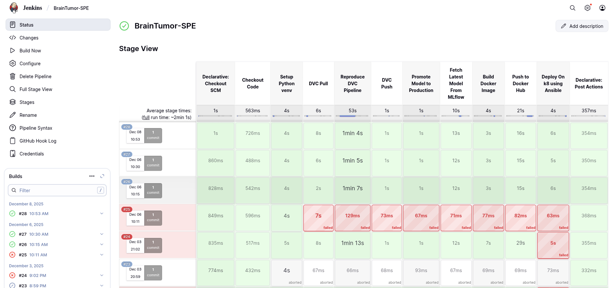
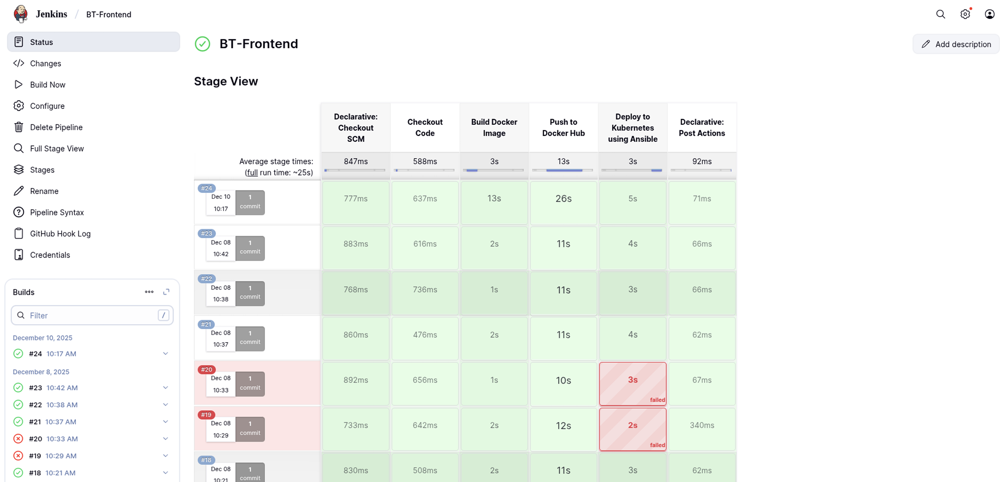
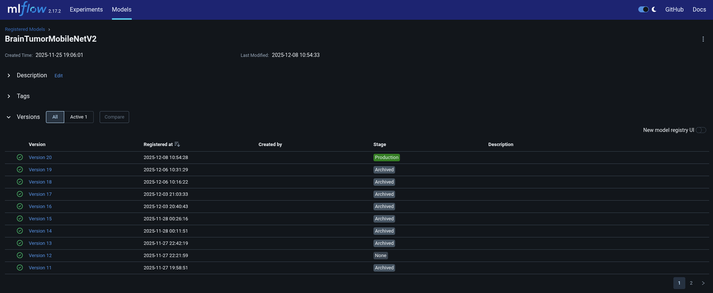
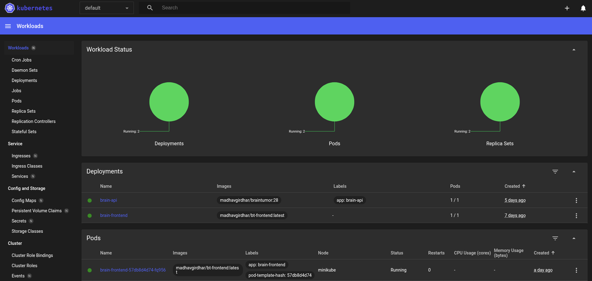
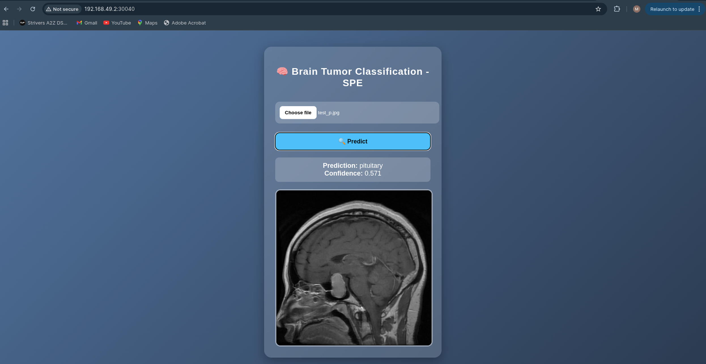
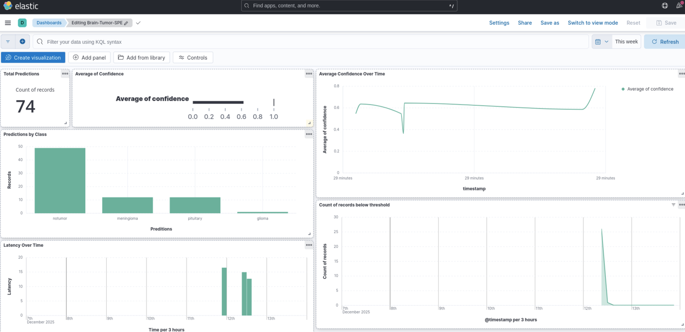

# Brain Tumor Classification MLOps Pipeline

An end-to-end MLOps pipeline for **Brain Tumor Classification** using **MobileNetV2**, integrated with modern DevOps and deployment tools including Jenkins, Docker, Kubernetes, MLflow, DVC, Ansible, and ELK Stack.

---

## Project Overview

This project implements a complete production-grade Machine Learning Operations (MLOps) workflow for automated brain tumor classification using MRI images.

The system focuses not only on model accuracy but also on:

* Automated CI/CD
* Model versioning
* Reproducibility
* Secure deployment
* Scalable orchestration
* Monitoring and observability

The complete workflow integrates:

* GitHub
* Jenkins
* DVC
* MLflow
* Docker
* Kubernetes
* Ansible
* ELK Stack

---

## Features

* Brain Tumor Classification using **MobileNetV2**
* Automated CI/CD pipeline with Jenkins
* Data versioning using DVC
* Experiment tracking with MLflow
* Dockerized deployment
* Kubernetes orchestration
* Ansible-based deployment automation
* Secure credential handling with Ansible Vault
* Horizontal Pod Autoscaling (HPA)
* ELK Stack integration for monitoring and centralized logging
* Frontend interface for MRI image prediction

---

## Tech Stack

### Machine Learning

* Python
* TensorFlow
* Keras
* MobileNetV2

### MLOps & DevOps

* Jenkins
* Docker
* DockerHub
* Kubernetes (Minikube)
* Ansible
* MLflow
* DVC

### Monitoring & Logging

* Elasticsearch
* Logstash
* Kibana

### Backend & Frontend

* Flask

---

## System Architecture

```text
GitHub Push
     ↓
GitHub Webhook (Ngrok)
     ↓
Jenkins CI/CD Pipeline
     ↓
DVC Pull + Pipeline Reproduction
     ↓
Model Training & Evaluation
     ↓
MLflow Experiment Tracking
     ↓
Docker Image Build
     ↓
DockerHub Push
     ↓
Ansible Deployment Automation
     ↓
Kubernetes Deployment
     ↓
HPA Scaling + ELK Monitoring
```

---

## Workflow

### 1. Dataset Versioning

* Dataset changes are tracked using DVC.
* Ensures reproducibility across experiments.

### 2. CI/CD Automation

* GitHub webhooks trigger Jenkins automatically.
* Jenkins executes the full ML pipeline.

### 3. Model Training

* MobileNetV2 is used for MRI image classification.
* Transfer learning improves training efficiency.

### 4. Experiment Tracking

* MLflow logs:

  * Metrics
  * Hyperparameters
  * Artifacts
  * Model versions

### 5. Containerization

* Flask inference service is containerized using Docker.

### 6. Kubernetes Deployment

* Docker images are deployed on Kubernetes using rolling updates.

### 7. Infrastructure Automation

* Ansible automates deployment and configuration management.

### 8. Monitoring & Logging

* ELK Stack centralizes:

  * Jenkins logs
  * Kubernetes logs
  * Flask API logs
  * Docker logs

---

## Screenshots

### Jenkins Pipeline - Model Execution

<p align="center">
  
</p>

---

### Jenkins Pipeline - Frontend Deployment

<p align="center">
  
</p>

---

### MLflow Model Registry

<p align="center">
  
</p>

---

### Kubernetes Dashboard

<p align="center">
  
</p>

---

### Final Application Prediction Interface

<p align="center">
  
</p>

---

### Kibana Dashboard

<p align="center">
  
</p>


---

## Project Structure

```text
├── app/
├── model/
├── data/
├── dvc.yaml
├── Dockerfile
├── Jenkinsfile
├── ansible/
├── kubernetes/
├── requirements.txt
└── README.md
```

---

## Setup Instructions

### Clone Repository

```bash
git clone https://github.com/your-username/Brain-Tumor-Deployment-Pipeline.git
cd Brain-Tumor-Deployment-Pipeline
```

### Install Dependencies

```bash
pip install -r requirements.txt
```

### Pull DVC Data

```bash
dvc pull
```

### Run Training Pipeline

```bash
dvc repro
```

### Run Flask App

```bash
python app.py
```

---

## Docker Setup

### Build Docker Image

```bash
docker build -t brain-tumor-app .
```

### Run Container

```bash
docker run -p 5000:5000 brain-tumor-app
```

---

## Kubernetes Deployment

```bash
kubectl apply -f kubernetes/
```

---

## Challenges Faced

* Kubernetes authentication issues
* Secure credential handling
* DVC integration inside CI pipelines
* MLflow artifact management
* Multi-tool orchestration stability
* ELK Stack configuration and compatibility

---

## Future Improvements

* GPU-based Kubernetes deployment
* Real-time monitoring alerts
* Automated retraining pipelines
* Multi-model deployment support
* Cloud-native deployment on AWS/GCP/Azure

---

## Contributors

* Vrajnandak Nangunoori
* Madhav Girdhar

---

## References

* TensorFlow
* Kubernetes
* Jenkins
* MLflow
* DVC
* Docker
* ELK Stack

---

## License

This project is developed for academic and educational purposes.

